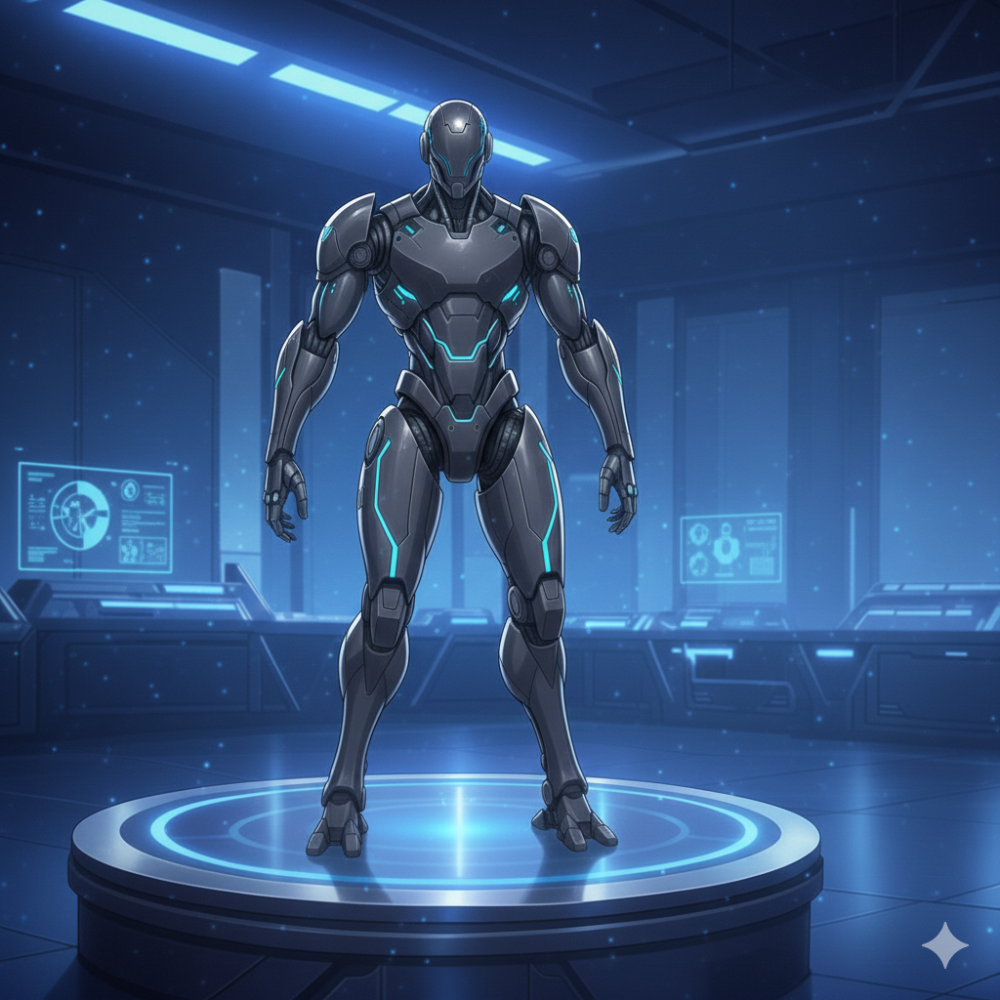
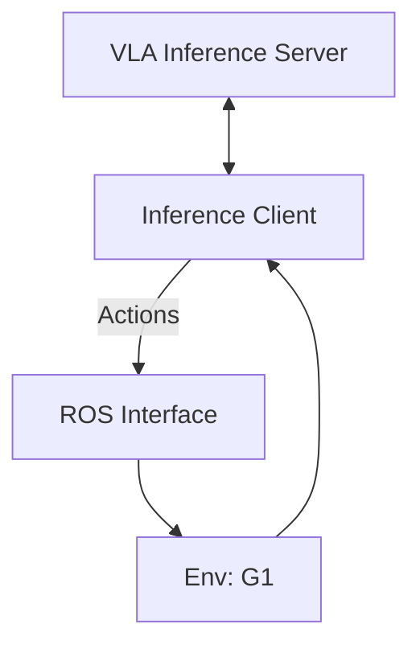

# shadow-robot
VLA implementation for Humanoid Robots




```bash
uv run src/main.py
```

## Architecture


```mermaid
graph TD
    A[VLA Inference Server] <--> B[Inference Client]
    C[Env: G1] --> B
    D[ROS Interface] --> C
    B -- Actions --> D
```
